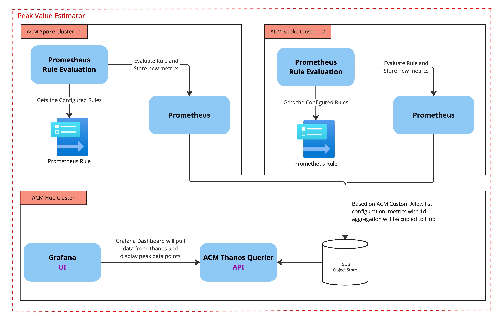

# Improved Right Sizing experience in Red Hat Advanced Cluster Management for OpenShift

In today's cloud-native landscape, resource optimization is critical for maintaining operational efficiency, controlling costs, and enhancing cluster performance. The latest enhancements to the Right Sizing feature in Red Hat Advanced Cluster Management for OpenShift (RHACM) provide actionable insights and tools to address these needs.

These enhancements represent a significant leap forward in managing OpenShift cluster resources. They enable cluster administrators to make more informed decisions about resource (CPU/Memory) requests and limits at the **Namespace** or **Virtualization VM** level, directly within the RHACM console.

# Architecture Overview 

The ACM Right Sizing recommendations presented above are calculated with the following approach.
* **Prometheus Recording Rule (PrometheusRule)**: We calculate CPU and memory capacity/usage at the namespace and cluster levels using the PrometheusRule. This rule is used for aggregating data over periods of up to 1 day; it is not utilized for data points beyond 1 day due to the low data retention period (15 days). The rule is evaluated on each managed cluster.
* **Data Forwarding**: Records for one day are then forwarded to RHACM Hub using the [observability-metrics-custom-allowlist](https://docs.redhat.com/en/documentation/red_hat_advanced_cluster_management_for_kubernetes/2.12/html-single/observability/index#creating-custom-rules).
* **Grafana Aggregation**: Grafana is used to calculate aggregated data over multiple time periods, including 5, 10, 30, 60, 90, and 120 days, at runtime.

# Right Sizing Solution in Action

# Different Variants of Right Sizing 

As of now, we support two variants of Right Sizing in **dev-preview**. You can read the individual documentation to get a better understanding of the solution as well as installation steps:
1. [Namespace Level](./docs/rs-namespace/README.md) 
2. [Virtualization VM Level](./docs/rs-virtualization/README.md). 

In the future, we plan to add Right Sizing at the **workload** level as well. 

# Disclaimer

* Prometheus rules are based on **Cluster Name**, NOT Cluster ID.
* CPU/Memory requests, usage, and recommendations show the maximum/peak values over the selected number of aggregated days.
* As this is an enhanced developer preview, performance issues may occur when loading the Grafana dashboard..
* Currently, we are not back-filling historical data points. After installing the ACM Right Sizing component, administrators will need to wait for data to be collected.
